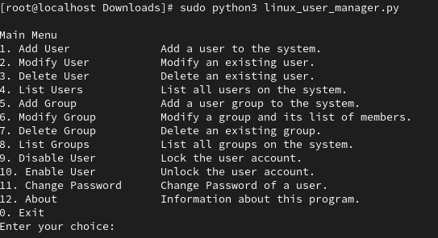

# **Linux User Manager**  

## **Overview**  
**Linux User Manager** is a command-line tool designed to simplify and automate user and group management on Linux systems. It provides an interactive menu-driven interface, enabling administrators to add, modify, delete, and manage users and groups efficiently. The tool also logs all actions for auditing purposes.  

## **Features**  
✔️ Add, modify, and delete system users  
✔️ Manage user passwords and account status (enable/disable)  
✔️ Add users to groups and modify group settings  
✔️ Change user attributes such as shell, home directory, and expiration date  
✔️ Log all operations to a file for auditing  
✔️ Simple and interactive menu-driven interface  

## **Requirements**  
- Linux-based OS  
- Python 3.x  
- `sudo` privileges  

## **Installation**  
1. Clone the repository:  
 ```bash
   git clone https://github.com/youssefahmed8/Linux_User_Manager-ITI.git
   cd linux-user-manager
 ```
2. Ensure you have Python installed: 
    `python3 --version`

3. Run the script with `sudo`:
    `sudo python3 linux_user_manager.py`

## After running the command, the following menu should appear:



## Example Commands

### Adding a User
1. Enter **option 1**, then type the username.
2. Set a password when prompted.

### Modifying a User
1. Enter **option 2** and select an attribute to modify:
   - Change shell  
   - Change home directory  
   - Set expiration date  
   - Add user to a group  

### Deleting a User
1. Enter **option 3** and confirm the deletion.

### Managing Groups
- **Add a group** → Enter **option 5**  
- **Modify a group** (rename or add users) → Enter **option 6**  
- **Delete a group** → Enter **option 7**  

### Account Management
- **Disable a user account** → Enter **option 9**  
- **Enable a user account** → Enter **option 10**  
- **Change user password** → Enter **option 11**  

## Logging
All operations are recorded in `/home/joeo/output.txt` for auditing.

## Error Handling
- The script ensures user inputs are validated.  
- Only numeric inputs are accepted for menu navigation.  
- Invalid operations return appropriate error messages.  

## Security Considerations
- The tool requires **sudo privileges** to execute system commands.  
- User passwords are securely modified using `chpasswd`.  

## Contributing
Contributions are welcome! If you'd like to improve this tool, feel free to submit a pull request or open an issue.
